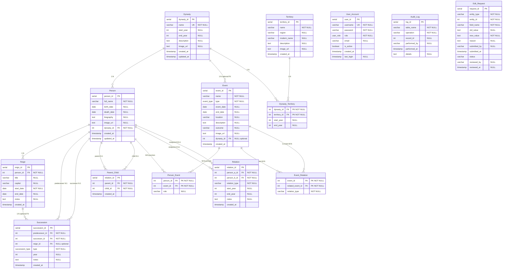

# Database schema diagram (Dynasty Archives)

Source: `sql/schema.sql`

---

## Mermaid ER diagram

---

## Foreign keys (explicit references)

| From | → To |
|------|------|
| `Person.dynasty_id` | `Dynasty.dynasty_id` |
| `Reign.person_id` | `Person.person_id` |
| `Event.dynasty_id` | `Dynasty.dynasty_id` *(nullable)* |
| `Succession.predecessor_id` | `Person.person_id` |
| `Succession.successor_id` | `Person.person_id` |
| `Succession.reign_id` | `Reign.reign_id` *(nullable)* |
| `Parent_Child.parent_id` | `Person.person_id` |
| `Parent_Child.child_id` | `Person.person_id` |
| `Person_Event.person_id` | `Person.person_id` |
| `Person_Event.event_id` | `Event.event_id` |
| `Relation.person_a_id` | `Person.person_id` |
| `Relation.person_b_id` | `Person.person_id` |
| `Event_Relation.event_id` | `Event.event_id` |
| `Event_Relation.related_event_id` | `Event.event_id` |
| `Dynasty_Territory.dynasty_id` | `Dynasty.dynasty_id` |
| `Dynasty_Territory.territory_id` | `Territory.territory_id` |

---

## Relationship summary

| Relationship | Cardinality | Bridge / notes |
|--------------|-------------|----------------|
| Dynasty — Person | **1:N** | `Person.dynasty_id` required |
| Dynasty — Event | **1:N** | optional: `Event.dynasty_id` |
| Person — Reign | **1:N** | |
| Person — Event | **M:N** | **`Person_Event`** (`person_id`, `event_id`) |
| Dynasty — Territory | **M:N** | **`Dynasty_Territory`** (`dynasty_id`, `territory_id`) |
| Person — Person (parent/child) | **M:N** | **`Parent_Child`** |
| Person — Person (typed link) | **M:N** | **`Relation`** |
| Event — Event | **M:N** | **`Event_Relation`** |
| Person — Succession (predecessor) | **1:N** | `Succession.predecessor_id` |
| Person — Succession (successor) | **1:N** | `Succession.successor_id` |
| Reign — Succession | **1:N** | optional `Succession.reign_id` |

**Isolated (no FK):** `User_Account`, `Audit_Log`, `Edit_Request` *(logical refs only via `entity_type` + `entity_id`)*.

---

## Hand-drawn conversion hint

Draw **14 boxes**: the entities above. Use arrows labeled with the FK column name. Mark **PK** under column lists and circle **FK** columns. Junction tables get a diamond or bridge notation between the two parents.
