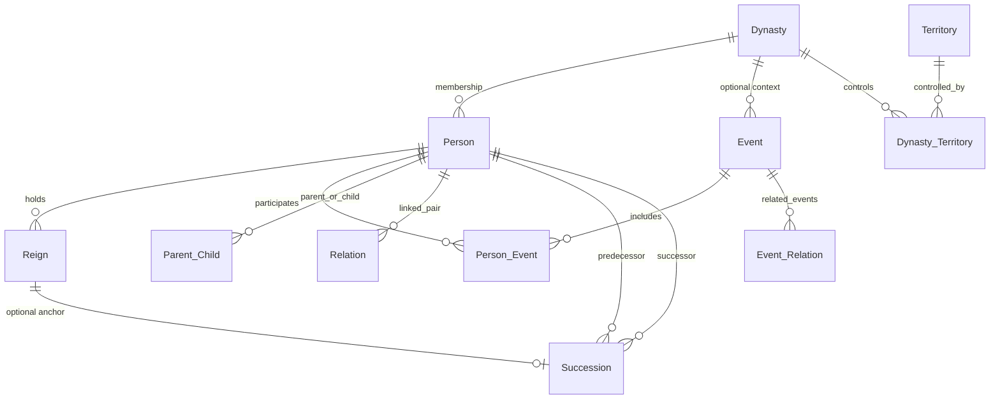

# Dynasty Archives — ERD and conceptual data model

This document explains the **Entity–Relationship (ER) structure** behind `sql/schema.sql`: entities (tables), attributes, **relationships**, **cardinality**, **optional participation vs total participation**, **weak entities**, **associative (bridge) entities**, **derived data**, and where **views** fit in.

Notation hints:

- **1 — N** means “one to many” (one row on the left can relate to many on the right).
- **N — M** means many-to-many (resolved with an associative table).
- **Total participation** on side **S**: every row on **S** must appear in the relationship (typically enforced by `NOT NULL` FK).
- **Partial participation**: the FK or link may be null or absent.

---

## 1. Entity overview

| Conceptual entity | Table | Strength | Notes |
|-------------------|--------|----------|--------|
| Dynasty | `Dynasty` | Strong | Historical dynasty / ruling house. |
| Person (ruler / figure) | `Person` | Strong | Must belong to exactly one dynasty in this model. |
| Reign | `Reign` | Strong | Time-bound rule of one person; depends on `Person`. |
| Event | `Event` | Strong | Battles, treaties, etc.; optional link to dynasty. |
| Territory | `Territory` | Strong | Geographic / regional unit. |
| User | `User_Account` | Strong | App login; isolated from historical entities. |
| Succession | `Succession` | **Weak (conceptually)** | Schema gives it own surrogate PK (`succession_id`), but it **cannot stand alone**: it always connects two persons (and optionally a reign). |
| Suggestions | `Edit_Request` | Strong | Workflow entity for viewer-proposed field changes. |
| Audit trail | `Audit_Log` | Strong | Append-style operational log (also fed by triggers). |

**Associative / bridge tables** (many-to-many or labeled edges):

- `Person_Event` — Person ↔ Event (plus role).
- `Dynasty_Territory` — Dynasty ↔ Territory (plus period attributes).
- `Parent_Child` — Person ↔ Person (parent/child).
- `Relation` — Person ↔ Person (spouse, ally, etc., with optional years).
- `Event_Relation` — Event ↔ Event (e.g. related battle).

---

## 2. Attributes by table

### `Dynasty`

| Attribute | Type / notes | ER notes |
|-----------|----------------|----------|
| `dynasty_id` | `SERIAL` PK | Surrogate identifier. |
| `name` | `VARCHAR(150)` UNIQUE NOT NULL | Natural descriptor; enforced unique. |
| `start_year`, `end_year` | `INT`, nullable | Span of dynasty (optional granularity). |
| `description` | `TEXT` | Optional narrative. |
| `image_url` | `TEXT` | Stored path/URL to artwork. |
| `created_at`, `updated_at` | `TIMESTAMP` | **Derived/maintained**: `updated_at` refreshed by trigger on update. |
| *(constraint)* | `chk_dynasty_years` | Business rule: `end_year >= start_year` when both exist. |

### `Person`

| Attribute | Type / notes | ER notes |
|-----------|----------------|----------|
| `person_id` | `SERIAL` PK | Surrogate. |
| `full_name` | `VARCHAR(200)` NOT NULL | |
| `birth_date`, `death_date` | `DATE` | Optional; CHECK ensures death ≥ birth when both set. |
| `biography`, `image_url` | `TEXT` | Optional. |
| `dynasty_id` | FK → `Dynasty` NOT NULL | **Total participation** of `Person` in “belongs to Dynasty”: every person has exactly one dynasty. |
| `created_at`, `updated_at` | `TIMESTAMP` | `updated_at` via trigger. |

### `Reign`

| Attribute | Type / notes | ER notes |
|-----------|----------------|----------|
| `reign_id` | `SERIAL` PK | |
| `person_id` | FK → `Person` NOT NULL | **Total**: every reign belongs to exactly one person. |
| `title`, `capital`, `notes` | Optional strings | Descriptive. |
| `start_date` | `DATE` NOT NULL | |
| `end_date` | `DATE` nullable | **Semantic**: null often means “still reigning / open-ended”. |
| `created_at` | `TIMESTAMP` | |

Trigger **validates** reign start against person’s `death_date` (cannot start after death).

### `Event`

| Attribute | Type / notes | ER notes |
|-----------|----------------|----------|
| `event_id` | `SERIAL` PK | |
| `name` | `VARCHAR(200)` NOT NULL | |
| `type` | `event_type` enum NOT NULL | war, battle, treaty, … |
| `event_date`, `end_date` | `DATE` | Optional span; CHECK `end_date >= event_date`. |
| `location`, `description`, `outcome`, `image_url` | Optional | |
| `dynasty_id` | FK → `Dynasty`, nullable | **Partial participation**: event may be unattached to a dynasty. |

### `Territory`

| Attribute | Type / notes | ER notes |
|-----------|----------------|----------|
| `territory_id` | `SERIAL` PK | |
| `name` | `VARCHAR(200)` NOT NULL | |
| `region`, `modern_name`, `description`, `image_url` | Optional | |
| `created_at` | `TIMESTAMP` | |

### `User_Account`

| Attribute | Type / notes | ER notes |
|-----------|----------------|----------|
| `user_id` | `SERIAL` PK | |
| `username` | UNIQUE NOT NULL | |
| `password` | NOT NULL | Stored hash (application responsibility). |
| `role` | `user_role` enum | `admin` \| `viewer`. |
| `email`, `is_active`, `last_login` | Optional / flags | Operational. |

Historical entities **do not** reference `User_Account`; separation of concerns.

### `Succession` (weak entity pattern)

| Attribute | Type / notes | ER notes |
|-----------|----------------|----------|
| `succession_id` | `SERIAL` PK | Surrogate (weak entities in textbook ER often use composite identification; here simplified to surrogate). |
| `predecessor_id`, `successor_id` | FK → `Person`, NOT NULL | **Two mandatory roles**; CHECK forbids same person twice. |
| `reign_id` | FK → `Reign`, nullable | **Partial**: succession may reference a specific reign or not. |
| `type`, `year`, `notes`, `created_at` | | Classification and chronology. |

**Cardinality (conceptual):**

- One **Succession** row connects **exactly one predecessor Person** and **exactly one successor Person** (binary relationship with attributes).

### `Parent_Child`

| Attribute | Type / notes | ER notes |
|-----------|----------------|----------|
| `relation_id` | `SERIAL` PK | Surrogate for the edge. |
| `parent_id`, `child_id` | FK → `Person`, NOT NULL | Self-relationship on **Person**; UNIQUE `(parent_id, child_id)`; CHECK `parent_id <> child_id`. |

**Cardinality:** Person **N — M** Person (role-named **Parent** vs **Child**).

### `Person_Event`

| Attribute | Type / notes | ER notes |
|-----------|----------------|----------|
| `(person_id, event_id)` | Composite PK, both FKs NOT NULL | **Associative entity** for Person ↔ Event **N — M**. |
| `role` | Optional `VARCHAR` | Attribute *of the relationship* (participant role). |

### `Relation`

| Attribute | Type / notes | ER notes |
|-----------|----------------|----------|
| `relation_id` | `SERIAL` PK | |
| `person_a_id`, `person_b_id` | FK → `Person`, NOT NULL | Undirected pair with CHECK `a <> b`; `relation_type` distinguishes spouse/ally/…. |
| `start_year`, `end_year`, `notes` | Optional | Relationship lifespan. |

### `Event_Relation`

| Attribute | Type / notes | ER notes |
|-----------|----------------|----------|
| `(event_id, related_event_id)` | Composite PK | Event ↔ Event **N — M** (e.g. battle linked to war). |
| `relation_type` | Default `'related_battle'` | |

### `Dynasty_Territory`

| Attribute | Type / notes | ER notes |
|-----------|----------------|----------|
| `(dynasty_id, territory_id)` | Composite PK | Dynasty ↔ Territory **N — M**. |
| `start_year`, `end_year` | Optional | **Relationship attributes**: control period; CHECK on years. |

### `Audit_Log`

| Attribute | Type / notes | ER notes |
|-----------|----------------|----------|
| `log_id` | `SERIAL` PK | |
| `table_name`, `operation`, `record_id` | | What changed. |
| `performed_by`, `performed_at`, `details` | | Who/when/text; `performed_at` defaults to now. |

Not drawn as FK to every table: **generic** logging pattern.

### `Edit_Request`

| Attribute | Type / notes | ER notes |
|-----------|----------------|----------|
| `request_id` | `SERIAL` PK | |
| `entity_type`, `entity_id` | Not FK-enforced in DDL | Polymorphic pointer (“person” / “dynasty” + id); enforced in application. |
| `field_name`, `old_value`, `new_value`, `reason` | | Suggestion payload. |
| `submitted_by`, `submitted_at`, `status`, `reviewed_by`, `reviewed_at` | | Workflow. |

---

## 3. Relationships and cardinality (summary)

Below, **mandatory** means total participation on that side where the schema uses `NOT NULL`.

| Relationship | Cardinality | Participation notes |
|--------------|-------------|---------------------|
| Dynasty — Person | **1 — N** | **Person → Dynasty**: mandatory (every person exactly one dynasty). **Dynasty → Person**: partial (a dynasty may have zero persons in DB). |
| Person — Reign | **1 — N** | Every reign **exactly one** person; a person may have **zero or many** reigns. |
| Person — Event (via `Person_Event`) | **N — M** | Link optional on both sides at entity level: an event need not list persons and vice versa; once linked, both FKs required in the bridge row. |
| Dynasty — Event | **1 — N** | Optional on Event side (`dynasty_id` nullable). |
| Dynasty — Territory (via `Dynasty_Territory`) | **N — M** | Bridge carries period; either side may have zero links. |
| Person — Person (`Parent_Child`) | **N — M** | Directed parent/child. |
| Person — Person (`Relation`) | **N — M** | Typed undirected pair (stored as ordered pair with constraint). |
| Person — Succession | **1 — N** twice | Each succession row has **one predecessor** and **one successor** (same entity set, different roles). |
| Event — Event (`Event_Relation`) | **N — M** | Related events. |

---

## 4. Derived attributes and views

**Derived** means “determined from other data” — either computed at read time or maintained by triggers.

| Kind | Example in this schema |
|------|-------------------------|
| **Stored but auto-maintained** | `Dynasty.updated_at`, `Person.updated_at` — updated by triggers, not supplied by every INSERT. |
| **Computed in views (classic derived attributes)** | `vw_reign_durations.reign_days` = `(COALESCE(end_date, CURRENT_DATE) - start_date)`; synthetic `end_date` column uses `COALESCE` for display. |
| **Computed in views** | `vw_succession_chain` — joins persons/dynasty names for display (derived labels). |
| **Filtered view** | `vw_wars_and_battles` — subset of events plus participants (`WHERE type IN ('war','battle')`). |
| **Timeline-style projection** | `vw_territory_timeline` — dynasty + territory + years from `Dynasty_Territory`. |

These views **do not store** extra copies of base tuples; they are **virtual** derived relations.

---

## 5. Total vs partial participation (quick reference)

| Side | Total participation? | Reason |
|------|-------------------------|--------|
| Person → Dynasty | **Yes** | `Person.dynasty_id` NOT NULL. |
| Reign → Person | **Yes** | `Reign.person_id` NOT NULL. |
| Event → Dynasty | **No** | `Event.dynasty_id` nullable. |
| Succession → Reign | **No** | `Succession.reign_id` nullable. |
| Optional historical rows | — | Territories, events, etc. may exist without being linked to every other entity. |

**User_Account** is totally disconnected from ER historical entities in the FK sense (no foreign keys between them).

---

## 6. Weak entities (how Succession fits)

In textbook ER, a **weak entity** depends on one or more **owner** entities for its identity and existence.

- **`Succession`** is documented in the schema as weak: it exists to describe a relationship between **two persons**, optionally anchored to a **reign**.
- Implementation choice: **`succession_id`** is a **surrogate primary key** rather than a composite `(predecessor_id, successor_id, year)` — simpler for ORMs and procedures, but conceptually still a dependent record.

---

## 7. Associative entities

Classic **N — M** relationships become their **own table** with optional **descriptive attributes**:

| Table | Connects | Relationship attributes |
|-------|-----------|---------------------------|
| `Person_Event` | Person, Event | `role` |
| `Dynasty_Territory` | Dynasty, Territory | `start_year`, `end_year` |
| `Parent_Child` | Person, Person | (implicit roles parent/child); surrogate `relation_id` |
| `Relation` | Person, Person | `relation_type`, years, `notes` |
| `Event_Relation` | Event, Event | `relation_type` |

---

## 8. Diagram (Mermaid)

You can render this in GitHub or many Markdown viewers.

`User_Account` has **no foreign keys** to historical tables (not shown). *(Mermaid cannot label two Person→Succession edges as predecessor vs successor without duplicating entity boxes; both roles use `Person.person_id`.)*

---

## 9. Integrity constraints as business rules

| Constraint | Meaning |
|------------|---------|
| `chk_dynasty_years` | Dynasty end year not before start year. |
| `chk_person_dates` | Death not before birth. |
| `chk_reign_dates` | Reign end not before start. |
| `chk_event_dates` | Event span consistent. |
| `chk_succession_different` | Predecessor ≠ successor. |
| `chk_no_self_rel` | No self-edge in `Parent_Child`. |
| `chk_relation_diff` | No self-pair in `Relation`. |
| `chk_event_relation_diff` | Event cannot relate to itself. |
| `chk_dt_years` | Territory control end ≥ start. |
| `ON DELETE RESTRICT` on Person→Dynasty | Cannot delete a dynasty if persons still reference it. |
| `ON DELETE CASCADE` on many child tables | Deleting a person cascades to reigns, links, etc., per policy. |

---

## 10. Procedures and consistency with the ERD

- **`sp_add_ruler`** — Inserts **Person** then **Reign** in one transaction (matches Person **1 — N** Reign).
- **`sp_record_succession`** — Inserts **Succession** and may close an open **Reign** on the predecessor.

---

This file is descriptive documentation only; the **source of truth** for column types and constraints remains **`sql/schema.sql`**.
